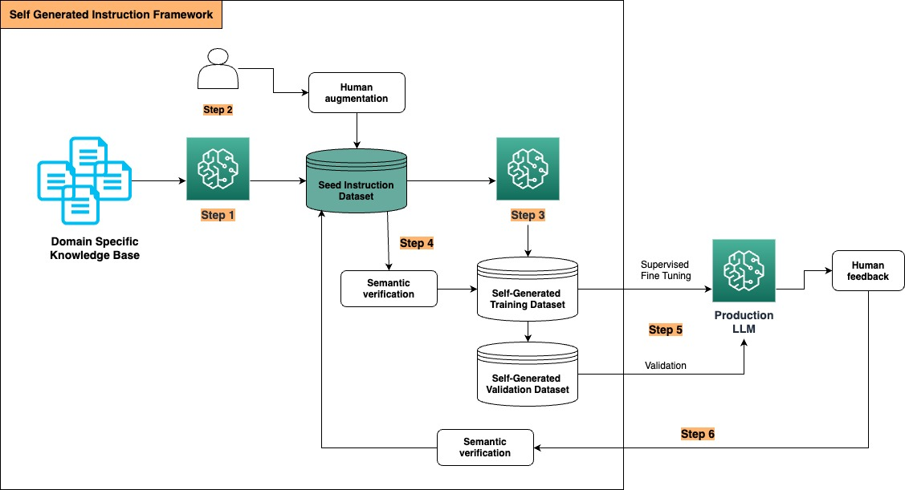

# Synthetic data generation for LLM fine tuning by self-instruct framework

This is the code example for the self-instruct framework that is used to synthetically generate datasets to fine-tune domain-specific LLMs and achieve optimal performance. 

### Introduction

LLM fine tuning/instruction tuning requires large volume of training data as well as human involvement for labeling, validation, and augmentation. However, the manual labeling of extensive training data and human SME evaluation of LLM response are resource-heavy and time-intensive. The following self-instruct framework addresses this challenge and minimize the human labeling effort. It is inspired by [this paper](https://arxiv.org/abs/2212.10560) published in the Association for Computational Linguistics (ACL’23). 

### Solution Architecture 



This framework consists of 6 steps. 

**Step 1**: Generate seed instruction dataset by LLM from the domain specific documents and/or Knowledge Base.   
Prompt an LLM to generate a "seed" dataset: write the prompt instruction based on your use case and task. For example, for a question-answer task 
```
You are an AI assistant, your task is to generate question-answer pair from the given context. 

Analyze the context within the <context> XML tag, generate one question from the context. 
provide answer to each question according to the content in the context. 
In your response, present the question within the <question> tag, and the answer within the <answer> tag.
DO NOT nest <question> and <answer> element. 
DO NOT put any extra attribute in the <question> and <answer> tag. 

<context>
{context}
</context>
```
**Step 2**: Human SMEs validate the "seed" dataset, and store the data in the "seed instruction data store".   
We will use the "seed" dataset to scale up the data generation. Leveraging human validation ensures the good quality of the seed data. 

**Step 3**: Generate training and validation dataset by LLM, from the "seed" dataset.    
You can prompt an LLM to generate more data from the "seed" dataset. For example,   
```
You are an AI assistant, your task is to generate question-answer pair from the given context. 

Analyze the context within the <context> XML tag and the seed question in <seed> XML tag,  generate four questions that rephrases the seed question within the <seed> XML tag. Make sure the generated questions are also relevant to the context within the <context> XML tag. 
In your response, present the question within the <question> tag.

<context>
{context}
</context>

<seed>
{seed_question}
</seed>
```
**Step 4**: Perform semantic validation between the "seed" dataset generated in Step 1 and the generated training/validation dataset in Step 3.     
This is to ensure the data used for training/validation are in good quality, in terms of (1) It has the diversity from the seed data (2) The two datasets are close enough semantically. You can use the semantic similarity such as Cosine distance, Manhattan distance or Euclidean distance to measure the two datasets.     
   
    
     
**Step 5**: Use the dataset generated in the previous step as the training/validation data for supervised fine tuning (SFT). 
     
**Step 6**: Collect human feedback from the fine-tuned LLM deployment. Add new inputs to the "seed" dataset and restart the loop of Step 1 to Step 5.    
Make this as a continuous process, keep adding new data to the "seed" data store from new documents and new knowledge from the business, and generating more training/validation datasets, then refining your LLM using the new data. 

### Code examples  
1. Synthetic Data Generation: 
2. LLM Fine Tuning (SFT): 

For example, we use this method to process one chapter (chapter 22.11) of the Dive into Deep Learning ([d2l.ai](https://d2l.ai/)) book. This is an open-source textbook authored by AWS ML/AI scholars and experts, that makes deep learning accessible to everyone. So far, this book has been adopted by more than 500 universities around the world, such as Cambridge, Stanford, MIT, CMU, etc. Been heavily used by MLU in their courses. 

We used Mistral-7B model and Claude3 Sonnet model to generate the synthetic training data, they both produce training data with good quality, validated by domain SME.  


The generated data was used to train a Mistral-7B model. 


The trained model was compared to a traditional RAG approach with Claude3 Sonnet model, to answer 374 questions from chapter 22.11 in the d2l.ai book. We use the Semantic Similarity Score to measure the accuracy between the  response and ground truth, it is evident that the fine-tuned Mistral-7B model provided comparable performance in accuracy to the RAG pipeline with a larger Claude3 Sonnet model .


## Contribute
If you would like to contribute to the project, see [CONTRIBUTING](CONTRIBUTING.md) for more information.

## License
The code examples in this library are released under the MIT-0 License. See the [LICENSE](LICENSE-NOTEBOOKS) file for details.
